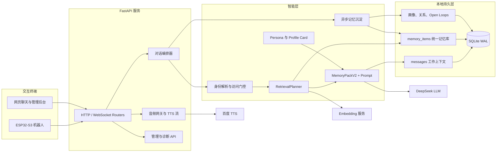
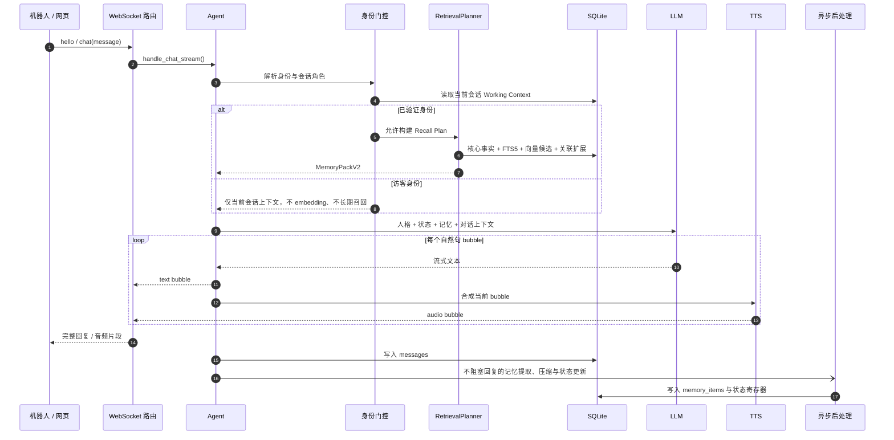
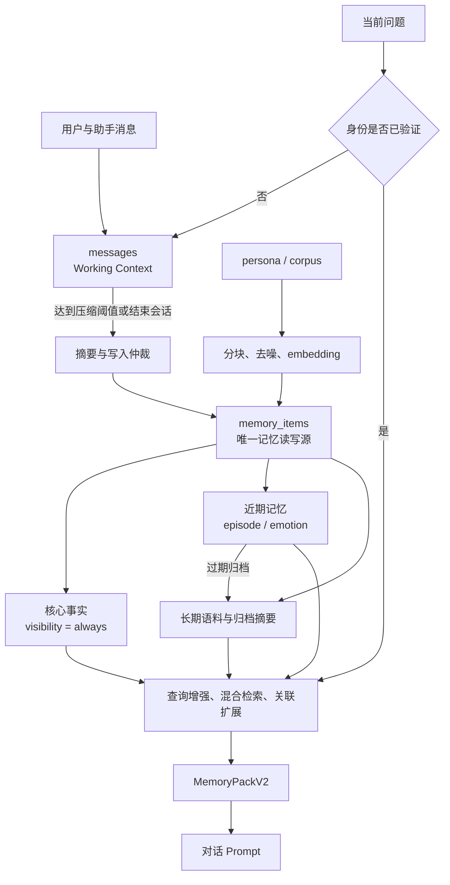
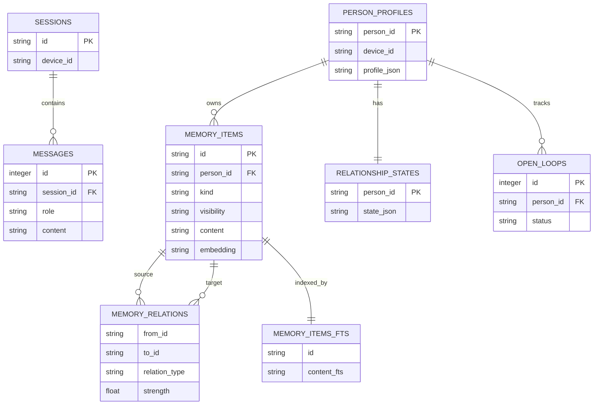

# SparkBot Personal Agent Backend

> 面向 ESP32-S3 陪伴机器人的实时对话与长期记忆后端。它把语音、身份、关系、记忆和人格组织为一条低延迟对话链路：既能即时回应，也能在不打断对话的前提下持续沉淀对人的理解。

## 项目定位

这是 SparkBot 的 Python FastAPI 后端。机器人或网页通过 WebSocket 发送文本/音频，后端调用 LLM 生成回复，按句切分为可播放的语音片段，并为已验证身份构建带有关系状态、画像与相关记忆的对话上下文。

它并非把聊天记录简单塞进 Prompt：`messages` 仅保存当前会话的 Working Context；所有可长期写入与召回的记忆都统一存入 `memory_items`，由检索规划器按身份与问题决定是否、以及如何使用。

## 核心能力

- **实时多端对话**：支持 HTTP、文本 WebSocket 与音频 WebSocket；流式回复按自然句边界切为 bubbles，TTS 可边生成边播放。
- **身份感知的记忆**：访客与已验证用户走不同的召回路径，避免把私人记忆暴露给临时使用者。
- **统一记忆库**：核心事实、情感事件、会话摘要、长期语料统一写入 `memory_items`，结合 SQLite FTS5 与向量相似度进行混合检索。
- **关系与情感连续性**：画像、关系状态和待跟进事项作为独立状态寄存器维护，避免把动态状态误当成静态记忆。
- **人格与语料驱动**：加载 persona/profile card，并将语料按块入库，使回复口吻与知识来源可配置、可复现。
- **可运维性**：内置管理后台、健康检查、备份、日志流、召回调试、服务状态与统一记忆完整性审计。

## 技术栈

| 层 | 选择 |
| --- | --- |
| API 与实时通信 | FastAPI、Uvicorn、WebSocket |
| 对话模型 | DeepSeek-compatible API（默认 `deepseek-chat`） |
| 向量模型 | DashScope `text-embedding-v3`，未配置时使用本地调试 fallback |
| 持久化 | SQLite（WAL）+ FTS5 |
| 语音 | 百度 TTS / 声音复刻，可关闭并仅返回文本 bubbles |
| 配置 | Pydantic Settings + `.env` |

## 系统架构



## 一次对话如何完成



主回复链路优先完成“理解—生成—送达”。会话摘要、核心事实提取、关系更新、画像更新与记忆归档在后台执行；同步 SQLite 操作通过 `asyncio.to_thread()` 脱离事件循环，避免持久化工作拖慢实时连接。

## 统一记忆系统

### 记忆生命周期



| 语义对象 | 作用 | 使用方式 |
| --- | --- | --- |
| `messages` | 当前会话的短期工作上下文 | 仅按 `session_id` 读取，达到阈值后压缩 |
| `memory_items` | 核心事实、近期记忆、长期语料与归档摘要 | 唯一的记忆写入与召回来源 |
| `memory_items_fts` | `memory_items` 的全文索引 | FTS5 关键词召回，与向量候选合并排序 |
| `person_profiles` | 人物画像 | 作为结构化画像注入 Prompt |
| `relationship_states` | 关系温度、情绪趋势与态度 | 每轮更新，提供动态陪伴语境 |
| `open_loops` | 待跟进事项 | 为后续对话提供可追踪的话题线索 |
| `memory_relations` | 记忆、实体与关系节点的关联边 | 在命中后扩展相关记忆 |

### 数据模型



## 巧妙设计

### 1. 先鉴权，再检索：把隐私控制放在架构分叉处

身份解析发生在记忆规划之前。临时 `person_id` 或访客模式只能读取当前 `messages`，不会触发长期召回和 embedding；已验证身份才有资格加载核心事实、近期/长期记忆与关联记忆。这不是在 Prompt 末尾附加一条“不要泄露”的软约束，而是从数据访问路径上消除了误召回的机会。

### 2. 一个记忆库，多种视图：避免“多层表”失去一致性

系统不让核心事实、会话摘要、近期记忆和长期语料分别写入彼此割裂的表。它们以 `kind`、`visibility`、时间字段和来源元数据共存于 `memory_items`，并由 `UnifiedMemoryStore` 提供统一语义。这样既能用 FTS5 命中精确关键词，也能用向量相似度处理语义表达，再按时间、重要性与关系边进行重排。

### 3. 关键路径快，理解持续生长

LLM 流式输出被切成可播放的自然句 bubbles，客户端无需等待整段答案。回复送达后，系统再异步进行事实抽取、工作上下文压缩、情感/关系更新、Open Loop 维护和画像增量更新。用户得到更快的第一响应，机器人则在每次对话后获得更完整的长期上下文。

### 4. 结构化状态与文本记忆各司其职

“用户喜欢咖啡”适合成为可召回的记忆项；“此刻关系温度”“尚未跟进的比赛结果”则分别属于关系状态与 Open Loop。将它们分开保存，既能避免状态漂移污染事实，也让后台管理与审计拥有清晰的可观测边界。

## 通信协议

### 文本聊天 WebSocket：`/ws/v1/chat`

| 消息 | 方向 | 说明 |
| --- | --- | --- |
| `hello` | 客户端 → 服务端 | 握手，携带 `token`、`device_id`、`session_id` |
| `chat` | 客户端 → 服务端 | 发送文本消息 |
| `abort` | 客户端 → 服务端 | 中断正在生成/播放的回复 |
| `session_end` | 客户端 → 服务端 | 收尾会话并触发记忆沉淀 |
| `new_session` | 客户端 → 服务端 | 强制切换到新会话 |
| `ping` / `pong` | 双向 | 连接保活 |
| text / audio bubbles | 服务端 → 客户端 | 流式文本与可选语音片段 |

音频链路使用 `/ws/v2/audio`；同步 HTTP 聊天入口为 `POST /v1/chat`。健康检查位于 `GET /health`，页面入口包括 `/`、`/chat` 和 `/admin`。

## 快速开始

### 1. 安装依赖

```bash
cd personal-agent-backend
python3 -m venv .venv
source .venv/bin/activate
pip install -r requirements.txt
```

### 2. 配置环境变量

```bash
cp .env.example .env
```

至少填入 `LLM_API_KEY`。建议同时配置 `EMBED_API_KEY` 以获得更好的语义检索效果；未配置时服务使用本地调试 fallback 向量。`API_TOKEN` 必须与机器人固件中的配置一致。

### 3. 启动服务

```bash
python -m app.main
```

开发模式也可使用：

```bash
uvicorn app.main:app --host 0.0.0.0 --port 8001 --reload
```

打开 `http://127.0.0.1:8001/` 进行聊天测试；管理后台位于 `http://127.0.0.1:8001/admin`。

### 4. 导入人格与语料（可选）

```bash
python scripts/compress_profile.py
python scripts/ingest.py
```

`persona/` 位于仓库根目录，路径可通过 `.env` 覆盖。首次或全量重建语料索引可执行 `python scripts/ingest.py --reset`。

## 配置要点

| 配置 | 用途 |
| --- | --- |
| `LLM_API_KEY` / `LLM_MODEL` | 对话模型凭据与模型名 |
| `EMBED_API_KEY` / `EMBED_MODEL` | 语义检索向量服务 |
| `SEARCH_BACKEND` | 默认 `sqlite`；可切换为 `es` |
| `API_TOKEN` | 机器人与后端 WebSocket 鉴权共享令牌 |
| `DB_PATH` | SQLite 数据库路径 |
| `WORKING_CONTEXT_TURNS` | 工作上下文压缩触发阈值 |
| `RECENT_MEMORY_RETENTION_DAYS` | 近期记忆保留天数 |
| `MAX_REPLY_CHARS` | 单条回复的代码级长度保护 |
| `TTS_API_KEY` / `TTS_CLONE_VOICE_ID` | 可选的百度 TTS 与声音复刻 |

完整说明请查看 [`.env.example`](.env.example)。不要把 `.env`、真实 API Key、`agent.db` 或私密聊天导入文件提交到仓库。

## 验证与质量保障

```bash
cd personal-agent-backend

# 单元与集成测试
python -m pytest -q

# 统一记忆架构审计：确认没有旧表/旧接口回流
python scripts/audit_unified_memory_integrity.py --strict

# WebSocket 模拟机器人联调
python scripts/test_ws_client.py

# HTTP + WebSocket 冒烟测试
python scripts/smoke_test.py
```

还可使用 `scripts/eval_emotional_memory.py` 运行情感陪伴评测，或在 `.env` 中开启 `CONSOLE_LOG_MODE=debug` / `trace` 观察 MemoryPack、召回候选与各阶段耗时。

## 目录地图

```text
personal-agent-backend/
├── app/
│   ├── main.py                 # FastAPI 生命周期与路由挂载
│   ├── agent.py                # 对话主流水线、Prompt 与异步后处理
│   ├── session.py              # SQLite Schema、迁移与持久层
│   ├── ws_handler.py           # 文本 WebSocket 协议
│   ├── routers/                # 聊天、音频、页面、健康检查、管理 API
│   ├── services/               # ASR、TTS 流、音频编排等服务
│   ├── memory/                 # 身份、召回、统一存储、压缩、状态与关系
│   └── persona/                # Persona Card 加载与语料入库
├── scripts/                    # 导入、评测、诊断、审计与联调脚本
├── tests/                      # 记忆语义、访客隔离、管理端等回归测试
├── static/                     # 聊天页与管理后台静态资源
├── deploy/                     # Docker、Nginx、systemd 部署材料
├── .env.example                # 环境变量参考
└── requirements.txt            # Python 依赖
```

## 安全边界

- **身份隔离**：访客不读取长期/关联记忆，不创建 embedding 查询。
- **最小化持久化暴露**：SQLite 位于服务端；管理能力通过 `/admin` 与管理 API 集中处理。
- **密钥不入库**：`.env` 仅保存在部署环境；提交前检查真实 token、数据库与私密导入数据。
- **可审计的记忆语义**：`audit_unified_memory_integrity.py --strict` 用于阻止旧分层表、旧接口或不一致术语重新进入项目。

## 部署

生产部署材料位于 [deploy/README.md](deploy/README.md)，包括 Docker Compose、Nginx、systemd 服务与 Elasticsearch 可选后端配置。

---

如果你正在构建一个真正会“记得人”的实体陪伴设备，欢迎从 `app/agent.py` 的主对话流水线和 `app/memory/router.py` 的召回规划开始阅读。
